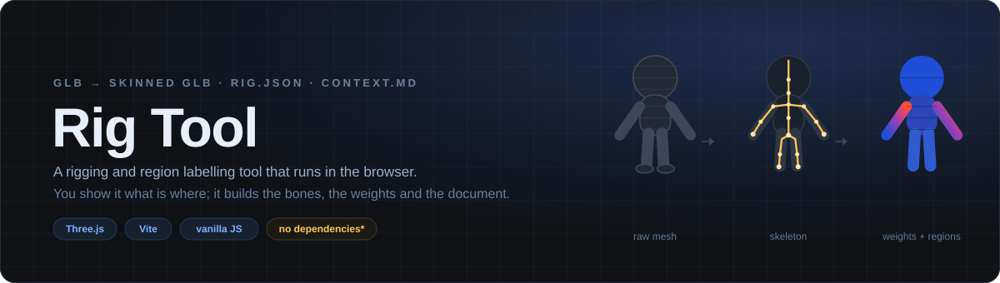
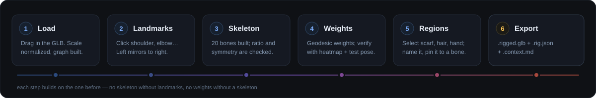
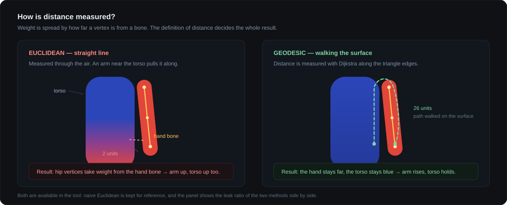

<p align="center">
  
</p>

<p align="center">
  <em>Hiçbir şey bilmeyen bir GLB'yi, ne olduğunu bilen bir GLB'ye çevirir.</em>
</p>

---

## Bu ne işe yarıyor?

Meshy, Tripo gibi araçlardan çıkan ya da elle modellenen GLB dosyaları **ham bir
yüzeydir**. İçinde kemik yoktur, hangi üçgenin atkı hangisinin el olduğu yazmaz.
Bir Three.js sahnesine koyduğunda elinde sadece bir vertex yığını olur:
karakteri hareket ettiremezsin, "şu atkıyı rüzgârda dalgalandır" diyemezsin,
üzerinde çalışan bir yapay zekâ asistanına da modelde ne nerede olduğunu
anlatamazsın.

Rig Tool bu boşluğu dolduruyor. Tarayıcıda modeli açıyorsun, birkaç noktaya
tıklayarak eklemlerin nerede olduğunu gösteriyorsun; araç iskeleti kuruyor, her
vertex'in hangi kemiğe ne kadar bağlı olduğunu hesaplıyor ve üç dosya veriyor:

| Dosya | Ne işe yarar |
| --- | --- |
| `model.rigged.glb` | Kemikli, skinlenmiş model. Three.js'te `SkinnedMesh` olarak yüklenir, kemikleri döndürünce deforme olur. |
| `model.rig.json` | Ham veri: landmark'lar, bölgeler, vertex index listeleri. **Araca geri yüklenebilir**, işi kaldığın yerden sürdürürsün. |
| `model.context.md` | İnsanın ve asistanın okuyabileceği özet: kemik ağacı, koordinatlar, etiketli parçalar, örnek kod. |

Son dosya projenin asıl fikri: modeli bir asistana verirken yanında
"`LeftForeArm` şurada, `Atkı` adlı parça şu vertex'lerden oluşuyor ve `Spine`
kemiğine bağlı" diyen bir belge de gidiyor.

---

## Akış

<p align="center">
  
</p>

---

## Hızlı başlangıç

Node 20+ gerekiyor.

```bash
git clone <repo-url>
cd rig-tool
npm install
npm run dev
```

Açılan sayfaya bir `.glb` dosyası sürükle. Hepsi bu — sunucu, hesap, yükleme
yok; model tarayıcıdan dışarı çıkmıyor.

```bash
npm run build     # dist/ altına statik çıktı
npm run preview   # build çıktısını yerelde sun
```

> **Geliştirici kısayolu:** Aynı modeli defalarca test ederken
> `?model=boy.glb&landmarks=boy.landmarks.json` sorgusuyla aç; sürükle-bırak
> adımını atlar, landmark'ları da hazır yükler.

---

## Kullanım

### 1 · Yükle

GLB'yi sürükle. Model **1 birim yüksekliğe normalize edilir** (Meshy çıktıları
her ölçekte gelebiliyor; kamera ve eşik değerlerinin sabit kalması için).
Normalize matrisi saklanır, export'ta istersen geri uygulanır.

Yüklemede komşuluk grafiği kurulur; konsola vertex sayısı, ada sayısı ve
ortalama komşu sayısı basılır. Aynı konumdaki kopya vertex'ler (UV seam'leri)
epsilon toleransla birleştirilir — birleştirilmezse yüzeyde yürüyen mesafe
dikişte durur.

### 2 · Landmark yerleştir

Panelden bir eklemi seç, modelde o noktaya tıkla. **20 landmark** var: kalça,
bel, göğüs, boyun, kafa ve iki taraf için köprücük / omuz / dirsek / bilek ve
kalça / diz / ayak bileği.

- **Simetri** açıkken sol tarafa koyduğun her nokta sağa aynalanır — yarı iş.
- **Eklem merkezini tahmin et** açıkken tıkladığın yüzey noktası değil, uzvun
  içindeki merkez alınır. Dirsek yüzeyde değil, kolun ortasındadır.
- Her landmark'ın altında nerede olması gerektiğini anlatan bir ipucu var.
- Doğrulama canlı çalışır: omurga sırası bozuksa, bir kemik neredeyse sıfır
  uzunluktaysa ya da bakış yönü ters görünüyorsa panel uyarır.

`JSON kaydet` ile landmark'ları diske al, `JSON yükle` ile geri getir.

### 3 · İskelet

Landmark'lar tamamlanınca **20 kemikli** hiyerarşi otomatik kurulur:

```
Hips
├── Spine ── Spine1 ─┬── Neck ── Head ── HeadTop
│                    ├── LeftShoulder  ── LeftArm  ── LeftForeArm  ── LeftHand
│                    └── RightShoulder ── RightArm ── RightForeArm ── RightHand
├── LeftUpLeg  ── LeftLeg  ── LeftFoot
└── RightUpLeg ── RightLeg ── RightFoot
```

İsimler yaygın humanoid konvansiyonu; önek yok, parmak kemiği yok. Parmak
kemikleri chibi/stilize modellerde ağırlık hesabını bozmaktan başka işe
yaramıyor.

### 4 · Ağırlık hesapla

Her vertex'in hangi kemikten ne kadar etkileneceği burada belirlenir. İki
yöntem var; ikisini de hesaplayıp panelde yan yana karşılaştırabilirsin.

<p align="center">
  
</p>

**Naif (Öklid)** — havadaki düz mesafe. Referans amaçlı duruyor: ne kadar bozuk
olduğunu görmek, geodezik yöntemin ne kadar düzelttiğini ölçmek için. Kol
gövdeye yakın durduğu için göğüs vertex'leri kol kemiğinden ağırlık kapar;
kolu kaldırınca göğüs de kalkar.

**Geodezik (yüzey)** — mesafe mesh yüzeyinde yürüyerek ölçülür. Elin ile uyluğun
havada 3 cm yakın olabilir, ama yüzeyde yürürsen aradaki yol kolun tamamı
kadardır; ağırlık sızmaz. Ek olarak **kemik kalınlığı** hesaba katılabilir:
mesafe kemik ekseninden değil uzvun yüzeyinden ölçülür, böylece ince kol kalın
gövdenin duvarını kendine çekemez.

Ayarlanabilir parametreler:

| Parametre | Aralık | Varsayılan | Etkisi |
| --- | --- | --- | --- |
| mesafe üssü (`p`) | 1 – 8 | 4 | Büyüdükçe en yakın kemik baskınlaşır, geçişler sertleşir. |
| yumuşatma | 0 – 5 | 1 | Komşu vertex'ler arası ağırlık farkını törpüler, eklemlerdeki kırılmayı azaltır. |
| kemik kalınlığı | açık / kapalı | açık | Mesafeyi kemik ekseninden değil uzvun yüzeyinden ölçer. |

Sonuç bölümü işin doğru gidip gitmediğini sayıyla söyler: süre, ortalama
etkileyen kemik sayısı, **boşta kemik** (hiçbir vertex'e hükmetmeyen kemik) ve
**sızıntı oranı** (gövde vertex'lerinin kol kemiklerinden ağırlık alan oranı).
Sızıntı %5'in üstündeyse panel uyarıya döner.

### 5 · Kontrol et — heatmap ve test pozları

Ağırlık algoritması görsel geri bildirim olmadan geliştirilemez, o yüzden teşhis
araçları ayrı bir eklenti değil, akışın parçası:

- **Heatmap** — bir kemik seç, o kemiğin her vertex üzerindeki ağırlığını renk
  olarak gör. `LeftArm` seçiliyken kol kırmızı, göğüs mavi olmalı.
- **Kemik döndür** — X/Y/Z kaydırıcılarıyla tek bir kemiği canlı çevir,
  sızıntıyı hareket hâlinde yakala.
- **Test pozları** — hazır pozlar: kolu kaldır, bacağı bük, bind pose'a dön.
- **Vertex incele** — modele tıkla, o vertex'i etkileyen kemikleri ve ağırlık
  değerlerini listele.

### 6 · Bölge etiketle

Otomatik ağırlık ne kadar iyi olursa olsun atkı, pelerin, saç gibi parçalarda
sızıntı kalır: bu parçalar havada bir uzva yapışık durur ama aslında gövdeye
bağlıdır. Bölge modu bunu elle düzeltmek için.

Modele tıklarsın, seçim yüzeyde yayılır ve iki koşuldan biriyle durur:
**yayılma mesafesi** limitini aşınca, ya da komşu yüzeyle arasındaki açı
**kenar açısı** eşiğini geçince (keskin kenar = doğal sınır). Daha zor parçalar
için parçanın çevresine nokta nokta tıklayıp `Halkayı kapat ve doldur`
diyebilir, seçimi tersine çevirebilirsin.

Seçimi adlandırıp kaydedersin — `Atkı`, `Pelerin`, `Sol El` gibi hazır isimler
listede. Kaydedilen bölgeyi tek bir kemiğe sabitleyebilir ya da bir oranla
karıştırabilirsin.

Bölgeler sadece ağırlık düzeltmek için değil, **parçayı adlandırmak** için de
var. "Burası atkı" bilgisi bir kez çıkarılınca `rig.json` ile birlikte taşınır
ve sonraki her işte (parça bazlı malzeme, texture, animasyon kısıtı) işe yarar.

### 7 · Export

Üç dosyayı tek tuşla ya da tek tek indir. `Orijinal ölçeğe döndür` açıkken model
kaynak GLB'nin ölçeğine geri döner; kapalıyken 1 birim boyunda kalır.

> Tarayıcı arka arkaya inen dosyaları engelleyebilir. İlk seferde "birden fazla
> dosyaya izin ver" sorusuna evet de; inmeyen olursa yukarıdan tek tek indir.

---

## Çıktı: `context.md` neye benziyor?

```markdown
## Kemikler

| kemik      | konum (x, y, z)       |
| ---        | ---                   |
| `Hips`     | -0.079, 0.627, -0.005 |
| `LeftArm`  |  0.097, 1.117, -0.004 |
| ...

## Etiketlenmiş parçalar

| parça  | vertex | merkez (x, y, z)    | boyut (g × y × d)     | bağlı kemik   |
| ---    | ---    | ---                 | ---                   | ---           |
| Atkı   | 195    | 0.326, 0.625, 0.221 | 0.524 × 0.501 × 0.278 | `Spine` (%80) |
| Sol El | 331    | 0.296, 0.541, 0.003 | 0.145 × 0.274 × 0.223 | `LeftHand`    |
```

Yanında bakış yönü, model yüksekliği, kemiğe erişim örneği ve "kemiği döndürmek
için `rotation` kullan, `position` bind pose'u bozar" gibi kullanım notları da
gelir. Koordinatlar export edilen GLB ile **birebir aynı uzayda**: üç dosya da
tek bir export mesh'inden üretiliyor.

Three.js tarafında kullanımı:

```js
const bone = model.getObjectByName('LeftArm');
bone.rotation.z = Math.PI / 4;

const region = rig.regions.find((r) => r.name === 'Atkı');
// region.vertices -> geometry.attributes.position içindeki index'ler
```

---

## Proje yapısı

```
src/
├── core/                 saf mantık, DOM bilmez
│   ├── loader.js         GLB yükleme, ölçek normalizasyonu
│   ├── adjacency.js      komşuluk grafiği, kopya vertex birleştirme
│   ├── landmarks.js      landmark deposu ve simetri
│   ├── skeleton.js       landmark'lardan kemik hiyerarşisi
│   ├── geodesic.js       yüzeyde en kısa mesafe (Dijkstra)
│   ├── weights.js        naif ve geodezik ağırlık hesabı
│   ├── regions.js        flood fill seçim, yol bulma, weight override
│   ├── pose.js           test pozları
│   ├── validate.js       landmark tutarlılık kontrolleri
│   └── exporter.js       GLB + rig.json + context.md üretimi
├── ui/                   panel bölümleri ve controller'lar
├── templates/
│   └── humanoid.json     landmark ve kemik şeması
└── main.js               sadece bağlantı kodu
```

Tek üretim bağımlılığı **Three.js**. Dijkstra, flood fill ve komşuluk grafiği
elle yazıldı — bu iş için kütüphane taşımaya değmiyor.

---

## Bilinen sınırlar

- **Tek mesh ile çalışır.** GLB içinde birden fazla mesh varsa en çok vertex'e
  sahip olan seçilir, diğerleri işleme girmez. Çok parçalı modelleri önce tek
  mesh'te birleştir.
- **Parmak kemiği yok.** Stilize modellerde faydadan çok zarar veriyor.
- **~50k vertex'e kadar** ana thread rahat. Üstünde ağırlık hesabı fark edilir
  şekilde bekletir; Web Worker'a taşımak ölçüm sonrası bir iş.
- **Bağlantısız adalara** (ayrı duran saç, aksesuar) yüzeyde yürüyen mesafeyle
  ulaşılamaz; bu adalar en yakın kemiğe bağlanır. Konsol kaç ada bulduğunu yazar.
- **Animasyon bu aracın işi değil.** Araç modeli animasyona hazır hâle getirir;
  animasyonu, modeli kullanan projede yazarsın.

---

## Lisans

[MIT](LICENSE)
